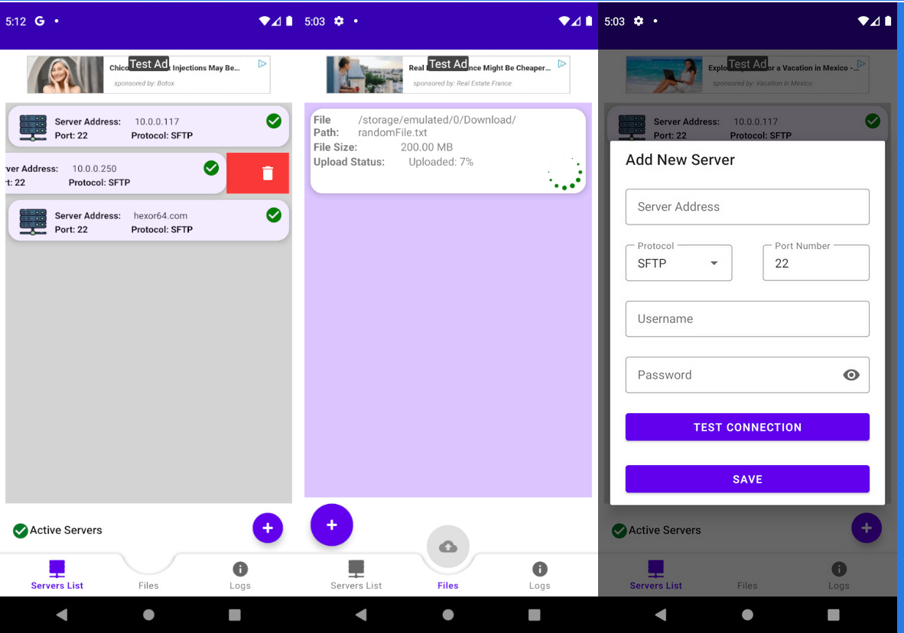

# SFTP Uploader

## Android SFTP Uploader in Kotlin and Java 

This app helps you upload your File(s) to your Server(s) using secure SSH File Transfer Protocol(SFTP).

It helps with automation and allows you to synchronizes your files and upload them to all your listed server with one click.

Secure File Transfer Protocol (SFTP) is a network protocol for securely accessing, transferring and managing large files and sensitive data.

[Download Google Play](https://play.google.com/store/apps/details?id=net.ghiassy.sftp_uploader "Download on Google Play")
